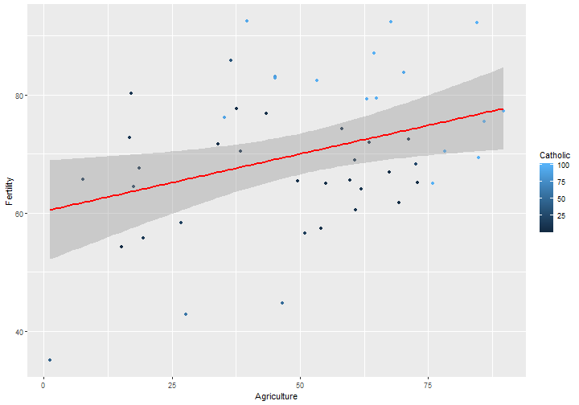

SwissApp Pitch
========================================================
author: Carlos Pertuz
date: 07/07/2019
autosize: true
transition: rotate

<small> 
Coursera Data Science Specialization
</small>

Intro
========================================================
transition: linear

Exploratory Analysis is the first step on any data science
project.

Having tools that allow us to quickly visualize the data increase
our chances the select the right model to solve our problem.

This app was conceived to check the different relationships of the swiss dataset,
by entering different combinations, the data scientist can get an idea of how the 
variables depend (or not) on each other.

Swiss Dataset
========================================================
The following is a snapshot of the dataset selected for this project


```r
str(swiss)
```

```
'data.frame':	47 obs. of  6 variables:
 $ Fertility       : num  80.2 83.1 92.5 85.8 76.9 76.1 83.8 92.4 82.4 82.9 ...
 $ Agriculture     : num  17 45.1 39.7 36.5 43.5 35.3 70.2 67.8 53.3 45.2 ...
 $ Examination     : int  15 6 5 12 17 9 16 14 12 16 ...
 $ Education       : int  12 9 5 7 15 7 7 8 7 13 ...
 $ Catholic        : num  9.96 84.84 93.4 33.77 5.16 ...
 $ Infant.Mortality: num  22.2 22.2 20.2 20.3 20.6 26.6 23.6 24.9 21 24.4 ...
```

Plot
========================================================
The following is the default plot displayed by the App



Links
========================================================
type: section

- Application: https://capertuz.shinyapps.io/swissapp/
- Github: https://github.com/capertuz/DataProducts
